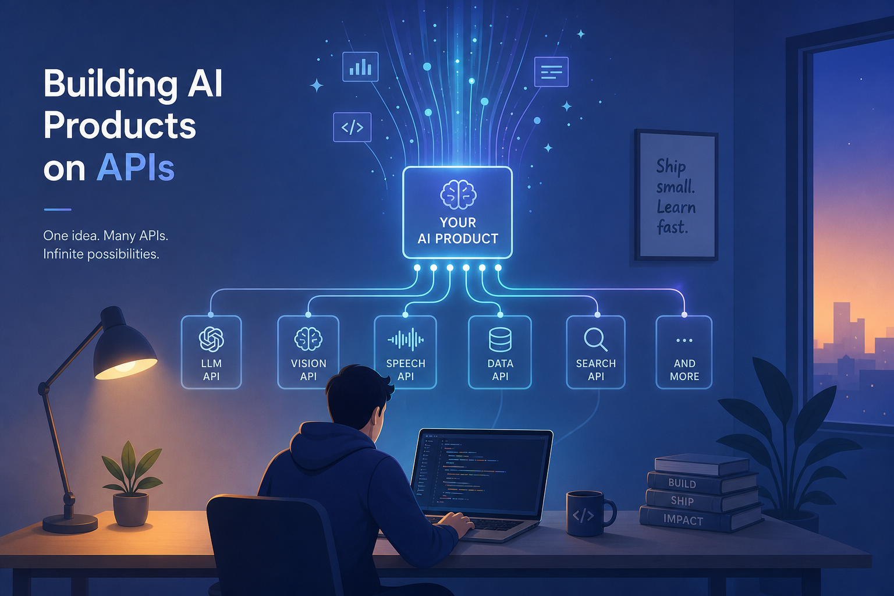

# 在 API 上跑了半年 AI 产品，我重新理解了「赚钱」这件事

去年年中我干了一件特别兴奋的事：花了两天时间，调了几个 API，套了个界面，上线了一个 AI 小工具。

上线那周我盯着后台数据，一个用户一个用户地刷新。第一个付费用户来的时候，我激动得差点截图发朋友圈。

半年过去了，那个产品还活着。月收入大概够我吃几顿好的，谈不上赚钱，但也不亏。

但在做这个产品的过程中，我发现了一件让我反复琢磨的事。

## 我所有的焦虑都来自「上面」

产品上线后，我的状态看起来很自由——想改什么改什么，想更新就更新。

但实际上我每天都在被动应对：

- 上游模型厂发布新版本，我的回复风格变了，用户来投诉
- API 价格调整，我的成本结构直接动摇了
- 某个流量渠道改了推荐算法，我的获客数字掉了一半
- 平台更新了政策，我的某个功能被迫下线

我意识到一个有点残酷的事实：**我这个产品的生死，大部分不掌握在我手里。**

我是一个做应用的，看起来我面向用户，但实际上我的背后站着一整条供应链——算力提供商、模型厂、云服务商、支付渠道、分发平台。他们任何一个人动动手指，我的处境就变了。

以前我以为这是因为我产品不够大、不够强。后来跟几个做 AI 的朋友聊，发现大家差不多——做应用层的，谁不是在几层楼上盖房子？

## 我观察到的几种活法

在和不同位置的人聊完之后，我把大家的生存状态分了分类。不是什么严谨的框架，就是一种观察：

一种是**在最底层卖材料的**。做芯片的、建机房的、供能源的。不管 AI 行业怎么吵、谁和谁打价格战，计算需求只涨不跌。他们不关心下游发生什么，反正你的计算要经过他们的硬件。

一种是**在最顶层控入口的**。浏览器、手机系统、超级 App。他们不一定做最火的 AI 产品，但他们掌握着用户走到 AI 面前的第一道门。下一代产品想触达用户，总得经过他们。

一种是**在中间做模型的**。这是这两年最风光也最累的一群人。模型能力确实是护城河，但这条河每年都在变浅——开源追上来的速度比所有人想的都快。今年领先的架构，明年可能就被开源社区复现了。

还有一种，也是大多数人——**在夹层做应用的，也就是我这类**。夹在中间，上要付 API 钱、中要给平台抽成、下要跟一堆同类产品抢用户。利润被上下两头挤着，能活下来就已经不错了。

有意思的是，活得最轻松的人，不是因为产品做得最用心，而是因为**位置选得好**。卖材料的和控入口的人，不需要拼产品细节，他们的护城河是结构性的，是产业分工本身决定的。

## 我慢慢接受了一个新视角

我以前判断一个 AI 产品好不好，习惯问：「这个东西比别的强在哪？」

现在我会先问：「**它处在整条链的哪个环节？**」

这个转变其实挺微妙的。

用「产品好坏」的视角看，你觉得好的产品应该赢。
用「环节位置」的视角看，你会发现有些人坐在那个位置上，就已经赢了八成——产品和它好不好关系不大。

听起来有点宿命论，但我觉得知道这个总比不知道好。至少在做决策之前，你知道赌桌上的牌是怎么发的。

## 我现在最相信的三件事

跑了半年，钱没赚多少，但这几件事我越来越确定：

**第一，别高估自己「做产品」的能力，也别低估「你在第几层」的影响。**
同样的产品，放在不同的环节，结果天差地别。在一个不占优势的位置上拼命卷产品细节，可能不如换个位置发力。

**第二，如果在夹层开始，那就要想办法攒点自己的东西。**
四张牌里，夹层最有可能攒的是两样：数据和用户关系。数据是因为你可以从自己的产品里不断产生；用户关系是因为你直接面对用户，这是上游的人没有的。这两样是夹层往上挪最现实的路。

**第三，「AI 经济 = Token 经济」这种框架，适合发朋友圈，不适合做决策。**
它告诉你大家在用同一个计量单位，但没告诉你谁在这个单位上加了多少杠杆、谁有定价权。就像问「互联网是什么」，答「数据包」——技术上没错，但对你做任何实际决定都没有帮助。

这是我跑了半年之后，最想说的东西。
