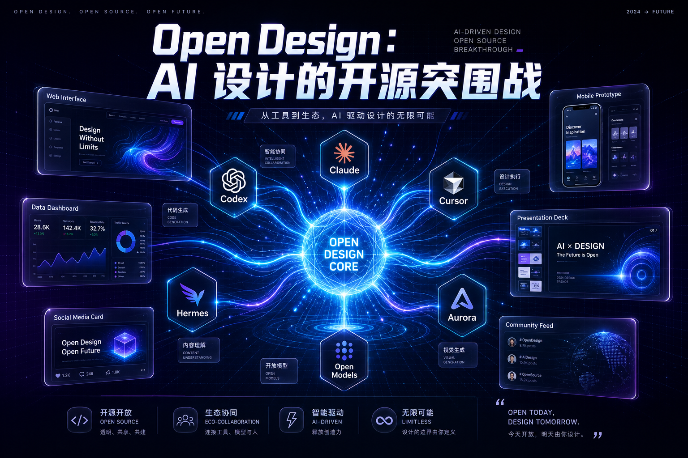
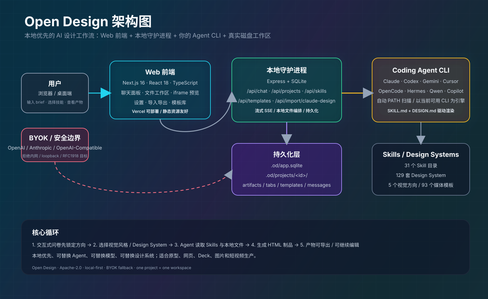

# Open Design：AI 设计的开源突围战

Anthropic 在 2026 年 4 月 17 日发布了 Claude Design，用 Opus 4.7 驱动 AI 设计输出，一夜爆火。但它闭源、付费、锁定 Anthropic 生态。

**Open Design（OD）是对此的正面回答**——同样的 "用 AI Agent 产生设计产出" 流程，但完全开源、本地优先、任意换 Agent、任意换 Design System、任意部署。

上线不到 10 天，GitHub 25,206 ⭐，2,739 Fork，146 Open Issues。Apache-2.0 协议。

---

## 相关地址

- **项目仓库**：[nexu-io/open-design](https://github.com/nexu-io/open-design)
- **官方网站**：[open-design.ai](https://open-design.ai)
- **技术栈**：Next.js 16 + TypeScript + Express 守护进程 + SQLite + Electron（可选）
- **许可协议**：Apache-2.0

---

## 视觉图示





> 上图海报强调“开源、Agent 编排、Design Systems、BYOK”四个关键词；下图把 OD 的核心链路拆成 Web 前端、本地守护进程、Agent CLI 与持久化层。

---

## 一句话回答 "这是什么"

你把一句话提示扔进去，OD 先弹一张交互式问卷锁定方向（不做 AI 即兴发挥），再给你 5 种视觉方向选择——每一种都绑定确定的 OKLch 色板 + 字体栈。Agent 把计划流式输出成 Todo 卡片，读写真实的磁盘文件，最终在一个沙盒 iframe 里渲染出 HTML 制品。可以下载 ZIP、导出 PDF/PPTX、甚至打开 Electron 桌面 App 截屏做端到端测试。

全程你用什么 Agent 都行——Claude Code、Codex、Cursor、Gemini CLI、OpenCode、Qwen、Hermes……OD 自动扫描你的 `PATH`，找到哪个用哪个。没有 CLI？粘贴任意的 OpenAI 兼容 API key，走 BYOK 代理通道。

---

## 架构：守护进程 + 浏览器 + 你的 Agent 的 File System

```
┌── 浏览器 (Next.js 16) ──────────────────────────────────────────┐
│  聊天面板 · 文件工作区 · iframe 预览 · 设置 · 导入导出            │
└──────────────┬───────────────────────────────────────────────────┘
               │ /api/* (SSE 流式)
               ▼
┌── 本地守护进程 (Express + SQLite) ───────────────────────────────┐
│  /api/agents · /api/skills · /api/design-systems                 │
│  /api/chat (SSE) · /api/projects · /api/templates                │
│  /api/proxy/{anthropic,openai,...}/stream (BYOK)                 │
│  /api/artifacts/save · /api/artifacts/lint                       │
│  /api/import/claude-design                                       │
└─────────┬────────────────────────────────────────────────────────┘
          │ spawn(cli, [...], { cwd: .od/projects/<id> })
          ▼
┌── 你机器上的 Coding Agent CLI ───────────────────────────────────┐
│  claude · codex · devin · gemini · opencode · cursor-agent       │
│  qwen · copilot · hermes (ACP) · kimi (ACP) · pi (RPC)           │
│  kiro (ACP) · kilo (ACP) · vibe (ACP) · deepseek                  │
│  读 SKILL.md + DESIGN.md，往真实磁盘写制品文件                     │
└──────────────────────────────────────────────────────────────────┘
```

关键设计决策：

| 决策 | 为什么重要 |
|------|-----------|
| **不内置 Agent** | 用你机器上已有的 CLI；没有就 BYOK API |
| **Skills 是文件不是插件** | 遵循 Claude Code 的 `SKILL.md` 规范，丢个文件夹进去就出现在选择器 |
| **Design System 是可移植 Markdown** | 9 段 `DESIGN.md`（色彩/排版/间距/布局/组件/动效/语调/品牌/反模式），不是 tema JSON |
| **Agent 在真实文件系统里跑** | `cwd` 指向 `.od/projects/<id>/`，Agent 有 Read/Write/Bash/WebFetch |
| **SQLite 持久化** | 项目 · 对话 · 消息 · 打开的文件标签页，关掉重开和昨天一模一样 |

---

## 31 个 Skills，内置可用

分两大模式：

- **Prototype 模式**（27 个）：web-prototype、saas-landing、dashboard、mobile-app、gamified-app、social-carousel、magazine-poster、dating-web、sprite-animation、motion-frames、pm-spec、kanban-board、finance-report、invoice、hr-onboarding、critique、tweaks、wireframe-sketch……
- **Deck 模式**（4 个）：guizang-ppt（默认）、simple-deck、replit-deck、weekly-update

每个 Skill 是一个文件夹：`SKILL.md` + `assets/template.html` + `references/*.md`。想要自己加一个？Copy 一个现有 Skill，照着 `docs/skills-protocol.md` 改 frontmatter，重启守护进程，就出现在选择器里。

## 129 套 Design System

**72 套来自 `awesome-design-md`**，覆盖你能想到的大部分品牌：Linear、Stripe、Vercel、Airbnb、Tesla、Notion、Apple、Anthropic、Cursor、Supabase、Figma、Xiaohongshu、Spotify、NVIDIA、SpaceX……

**57 套来自 `awesome-design-skills`**，直接放在 `design-systems/` 目录下。

切一个 Design System → 下一次渲染立刻用新的 token。不改代码，只改一个 dropdown。

---

## 文件格式支持

OD 的 Agent 在运行时读写真实磁盘文件，最终产出的成果物覆盖多种格式：

**Agent 产出物（输出）：**

| 格式 | 使用场景 | 驱动方式 |
|------|---------|---------|
| **HTML** | 落地页、Dashboard、手机原型、文档页 | 所有 `prototype` 模式 Skill |
| **PNG / JPG** | 海报、信息图、头像、产品图 | 调用 gpt-image-2 |
| **MP4** | 15s 短片、产品发布片、数据动画、TikTok 竖屏 | Seedance 2.0 / HyperFrames |
| **PDF** | 导出 / 归档 | 浏览器 Print（headless Chrome） |
| **PPTX** | 幻灯片 / 演讲 Deck | Agent 通过 Deck Skill 驱动 |
| **ZIP** | 项目打包导出 | Archiver |
| **Markdown** | 规约 / 规范 / 文档 | Agent 直接写入 |

**支持导入的格式：**

| 来源 | 格式 | 说明 |
|------|------|------|
| Claude Design 导出 | ZIP | `POST /api/import/claude-design` 解包为 .od 项目，Agent 可从中断处继续编辑 |
| Design System | Markdown（DESIGN.md） | 129 套，切换仅需一个 Dropdown |
| Skill | SKILL.md + assets/ | 丢文件夹进 `skills/` 即出现 |

**明确不支持：** Figma（.fig）、Sketch（.sketch）、XD（.xd）、Photoshop（.psd）等设计源文件导入。OD 走的路线是 **prompt → HTML**，不是 **上传设计稿 → 还原 HTML**。如果你需要后一种能力，Anima、Zeplin、Locofy、Builder.io 更合适。

---

## 媒体生成：不止代码，还出图出视频

在同一个聊天面板里，Agent 还可以驱动三种媒体生成模型：

| 表面 | 模型 | 用途 |
|------|------|------|
| 图像 | gpt-image-2（Azure / OpenAI） | 海报、头像、信息图、产品图、照片修复 |
| 视频 | Seedance 2.0（火山引擎） | 15 秒影视级短片、角色近景、MV 风格编排 |
| 视频 | HyperFrames HTML→MP4（HeyGen 开源） | 产品发布片、动态数据图表、TikTok 竖屏、Logo 动画 |

内置 **93 个可直接复现的提示词模板**（43 个图像 + 39 个 Seedance + 11 个 HyperFrames），带缩略图预览和来源标注。生成的 `.png` / `.mp4` 文件落在项目 Workspace 里作为可下载的成果物。

---

## 反 AI 废话（Anti-AI-Slop）机制

直接从 `huashu-design` 的设计哲学引入：

1. **必须先问，不准即兴**：第一轮只出 `<question-form>`，不做思考不用工具不写代码
2. **五维自我批评**：输出制品前先给自己打分（哲学/层次/执行/特化/克制），低于 3/5 就修
3. **品牌资产提取协议**：不要从记忆猜品牌色——定位源文件、grep 十六进制色值、写 `brand-spec.md`
4. **P0/P1/P2 检查清单**：每个 Skill 自带 `references/checklist.md`，P0 不过不准输出
5. **废话黑名单**：禁用激进紫色渐变、通用 emoji 图标、手绘 SVG 小人、Inter 作展示字体

---

## 与 Claude Design / Open CoDesign 对比

| 维度 | Claude Design | Open CoDesign | **Open Design** |
|------|:---:|:---:|:---:|
| 开源 | ❌ | MIT | **Apache-2.0** |
| 形态 | Web（claude.ai） | Electron 桌面 App | **Web + 本地守护进程** |
| Vercel 可部署 | ❌ | ❌ | **✅** |
| Agent 运行时 | 内置（Opus 4.7） | 内置（pi-ai） | **委托给你已有的 CLI** |
| Skills | 私有 | 12 个 | **31 个，基于 SKILL.md 文件，可拖入添加** |
| Design System | 私有 | DESIGN.md（v0.2 路线图） | **129 套** |
| Provider 灵活度 | 仅 Anthropic | 7+（通过 pi-ai） | **15 CLI + BYOK API 代理** |
| 启动问卷 | ❌ | ❌ | **✅ 硬规则，第一轮** |
| 方向选择器 | ❌ | ❌ | **✅ 5 种确定的方向风格** |
| Claude Design ZIP 导入 | 不适用 | ❌ | **✅ 从 Anthropic 中断处继续编辑** |
| 导出格式 | 有限 | HTML/PDF/PPTX/ZIP/Markdown | **HTML/PDF/PPTX/ZIP/Markdown** |

---

## 快速上手

```bash
git clone https://github.com/nexu-io/open-design.git
cd open-design
corepack enable
pnpm install
pnpm tools-dev run web
# 打开终端打印的 web URL
```

首次启动自动检测你的 Agent CLI，加载 31 个 Skills + 129 个 Design System。弹窗可粘贴 API Key（仅 BYOK 路径需要），之后 `.od/` 目录自动创建（SQLite 数据库 + 按项目隔离的工作文件夹）。

---

## 评估

**亮点：**

- 🎯 **定位精准**：不是 "AI 设计工具的又一个轮子"，而是直接对标 Claude Design、填补开源空白
- 🔧 **架构干净**：守护进程 + 浏览器 + 已有 CLI 的三层分离，每一层职责清晰
- 📦 **Skills 即文件**：遵循 Claude Code 的 `SKILL.md` 生态标准，社区贡献成本极低
- 🎨 **Design System 可移植**：纯 Markdown，不属于任何工具，你想拿到别处用完全可行
- 🧠 **提示词栈即产品**：从发现问卷到五维批评到检查清单，整套流程不只是 system prompt，而是被工程化的设计方法学
- 🚀 **增长速度惊人**：上线不到 10 天破 25K Stars，说明真实需求巨大
- 🆓 **Apache-2.0**：无使用限制，企业友好

**值得关注的风险：**

- 🧪 **还很新**：146 Open Issues，一些高级功能（Comment 模式、Tweaks 面板）还在开发中
- 🔌 **依赖本地 CLI**：对非技术用户门槛较高；好在 BYOK API 路径补了这个缺口
- 🏗️ **Desktop 仍在建设中**：Electron 桌面版尚在 placeholder 阶段
- 📊 **Vercel 部署层**：虽然可部署到 Vercel，但守护进程仍必须在本机运行——真正全云部署需要等

**适用范围：**

- ✅ 想用开源替代 Claude Design 的独立开发者 / 小团队
- ✅ 已有 Claude Code / Codex / Cursor 等 CLI，想给它们配设计能力
- ✅ 做原型 / landing page / pitch deck / 社交卡片等快速视觉产出
- ✅ 需要把 AI 设计产出留在自己机器上的本地优先用户
- ⚠️ 企业级全职设计师目前还是 Claude Design 更成熟（稳定、有官方支持）

---

## 总结

Open Design 是目前**最完整的开源 AI 设计工具**。它不是另起炉灶重新定义 "AI 辅助设计"，而是在 Claude Design 已证明的需求上，用开源架构、多 Agent 适配、Skills 文件系统和可移植 Design System 四个支点，做出了一个同等能力但完全开放的替代方案。

特别值得注意的信号：**它不是单一 Agent 的扩展，而是一个把已有 Coding Agent 当作设计引擎的 "Agent 编排层"**——这种架构模式正在越来越常见，Open Design 是目前这个模式里执行得最干净的项目之一。
